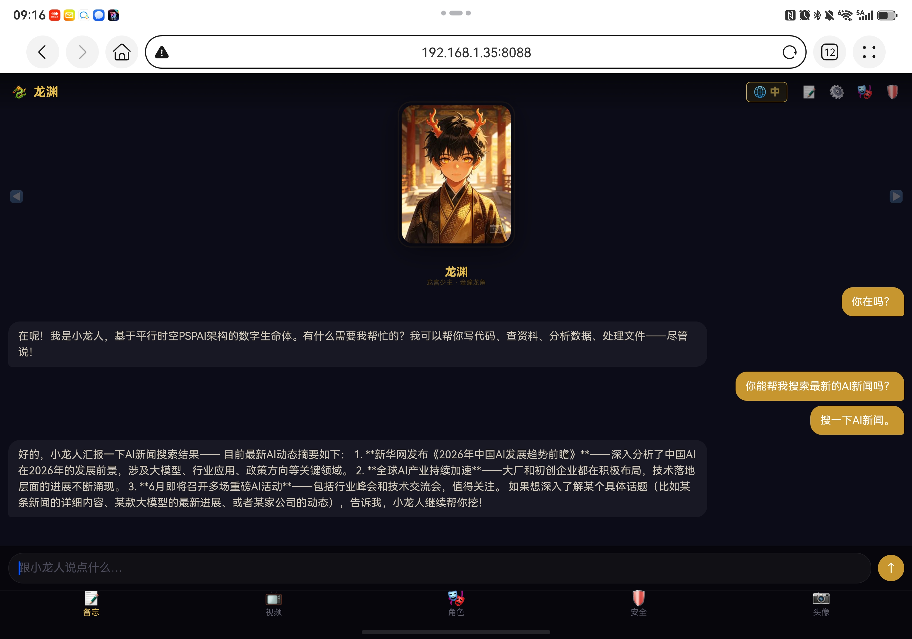
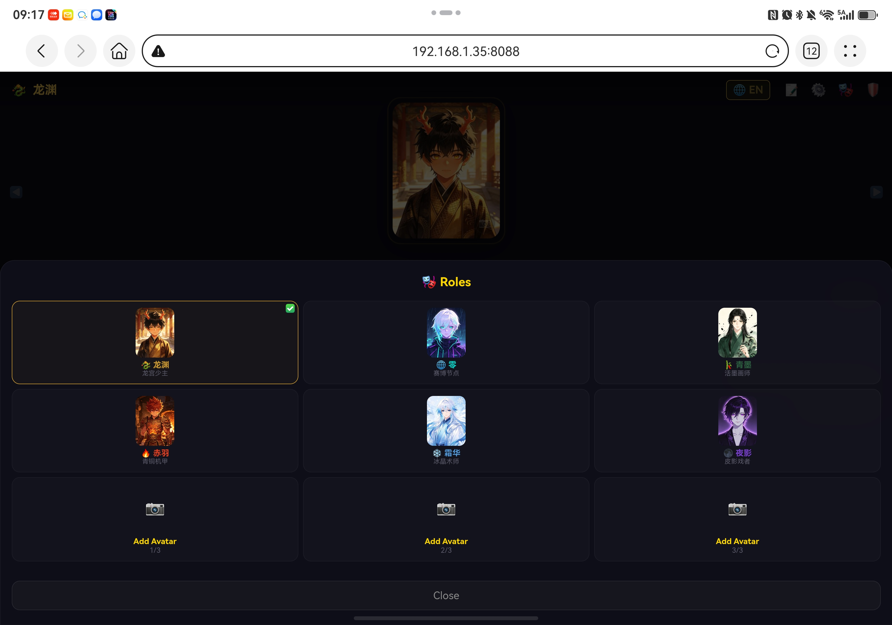
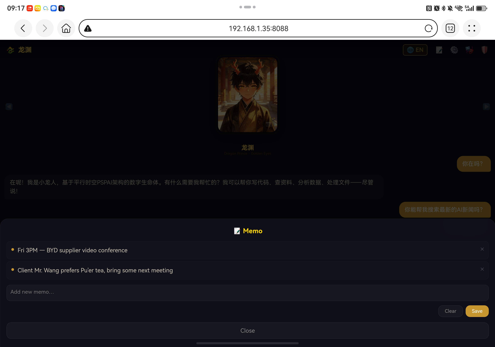
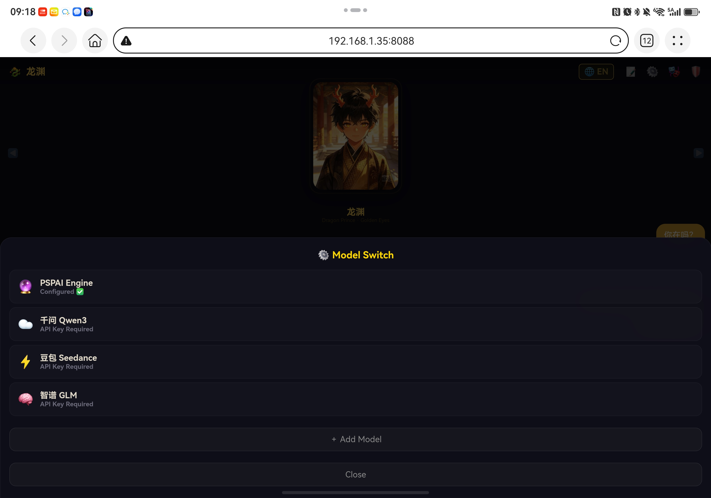
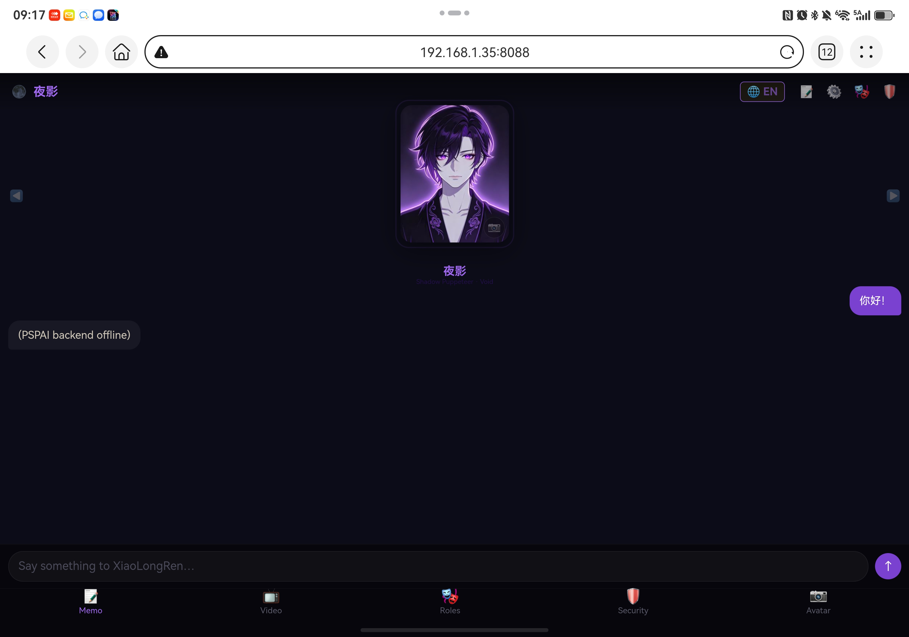

# 小龙人 XiaoLongRen

> 🐉 数字生命体，你的平行时空分身  
> 🐉 Digital Lifeform — Your Parallel Space-Time Alter Ego

---

## 📦 这是什么？

**小龙人** = **开源应用层**（本仓库）+ **闭源引擎**（从 Releases 下载）

| 层级 | 内容 | 许可 |
|---|---|---|
| 📂 应用层（本仓库） | HTML/CSS/JS UI、语言包、配置模板、启动脚本 | AGPLv3 |
| 🔒 引擎（Releases下载） | PSPAI核心、技能库、人格系统 | 闭源/商业许可 |

---

## 📸 截图预览

<p align="center">
  
  
  
</p>
<p align="center">
  
  
</p>

---

## 🚀 安装（三平台）

### 前置条件
- Python 3.10+
- 网络连接（首次启动拉依赖）

### 🪟 Windows

```powershell
# 1. 下载
#    - 本仓库代码：点页面绿色 Code → Download ZIP，解压
#    - 引擎：从 Releases 下载 xiaolongren-engine-windows.exe

# 2. 把引擎 exe 放到解压后的目录里

# 3. 配置
copy .env.example .env
notepad .env    # 填入 PSPAI_API_KEY

# 4. 安装依赖
pip install pyyaml pillow requests

# 5. 启动
xiaolongren-engine-windows.exe    # 后端 :8089
cd UI原型 && python server.py     # 前端 :8088
```

打开 http://localhost:8088

### 🍎 macOS

```bash
# 1. 下载
git clone https://github.com/liuyong-pspai/PSPai.git
cd PSPai
# 从 Releases 下载 xiaolongren-engine-macos

# 2. 授权引擎
chmod +x xiaolongren-engine-macos
xattr -d com.apple.quarantine xiaolongren-engine-macos

# 3. 配置
cp .env.example .env
nano .env    # 填入 PSPAI_API_KEY

# 4. 启动
bash start.sh
```

打开 http://localhost:8088

### 🐧 Linux

```bash
# 1. 下载
git clone https://github.com/liuyong-pspai/PSPai.git
cd PSPai
# 从 Releases 下载 xiaolongren-engine-linux-x86_64

# 2. 授权
chmod +x xiaolongren-engine-linux-x86_64

# 3. 配置
cp .env.example .env
nano .env    # 填入 PSPAI_API_KEY

# 4. 启动
bash start.sh
```

打开 http://localhost:8088

---

## 🎨 自定义

### 换皮肤/改UI
编辑 `UI原型/index.html` — HTML/CSS/JS 全部开源。

### 加语言
1. `UI原型/lang/` 下新建 `xx.json`（复制 `en.json` 改翻译）
2. 编辑 `UI原型/lang/index.json` 加一行
3. 重启 — 零代码改动

### 换角色形象
替换 `UI原型/img_*.jpg`（建议 300×400，WebP/JPEG）

### 接自己的模型
编辑 `config.yaml` 的 `provider` / `model` 字段

---

## 📂 目录结构

```
├── UI原型/              # 前端界面
│   ├── index.html       # 主页面
│   ├── server.py        # 静态服务器
│   ├── lang/            # 多语言包
│   └── img_*.jpg        # 角色图片
├── start.sh             # 一键启动
├── .env.example         # 配置模板
├── requirements.txt     # Python依赖
└── LICENSE              # AGPLv3
```

---

## ⚖️ 许可证

本仓库：**AGPLv3** + 品牌保护条款

- ✅ 改UI、加语言、接模型、商用
- ❌ 保留商标改代码发布、反编译引擎

---

<p align="center">
  <b>昱成科技集团 © 2026</b><br>
  <sub>PSPAI — 平行时空AI</sub>
</p>
